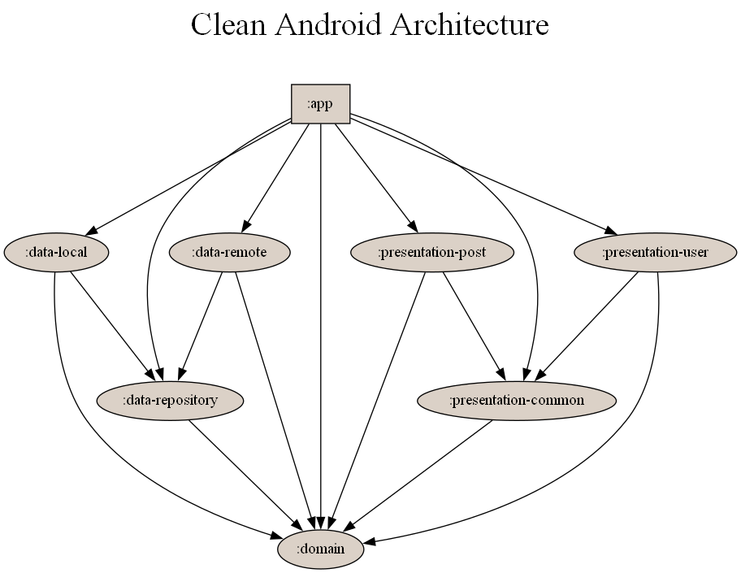

## Clean Android Architecture

This repository contains an implementation of a clean architecture for Android applications using Compose, MVVM, MVI, Hilt, Kotlin Flow, Repository, Room, Retrofit, Mockito, and JUnit.

The project is divided into several modules, including:

- `app`: The main application module, responsible for defining the UI using Compose and coordinating with the presentation layer.
- `domain`: The domain module, responsible for defining the business logic of the application and exposing it through interfaces.
- `data-repository`: The repository module, responsible for implementing the interfaces defined in the domain module and providing data from both the local and remote data sources.
- `data-local`: The local data source module, responsible for implementing the logic to access data stored locally, using Room as the database.
- `data-remote`: The remote data source module, responsible for implementing the logic to access data from a remote API, using Retrofit as the network client.
- `presentation-common`: The common presentation module, containing shared components and utilities used throughout the presentation layer.
- `presentation-post`: The presentation module for the posts feature, responsible for implementing the UI and the presentation logic related to posts.
- `presentation-user`: The presentation module for the users feature, responsible for implementing the UI and the presentation logic related to users.

The project follows a layered architecture approach, with each layer (presentation, domain, repository and data) having its own set of responsibilities and being completely decoupled from the other layers. The communication between the layers is done through well-defined interfaces, allowing for easy testing and future modifications.

### Dependencies

### Book

This project is based on the book [Clean Android Architecture: Take a layered approach to writing clean, testable, and decoupled Android applications](https://www.packtpub.com/product/clean-android-architecture/9781803234588) Packt.